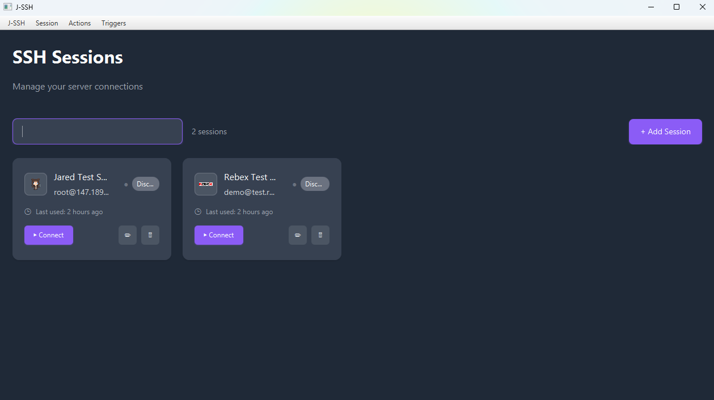
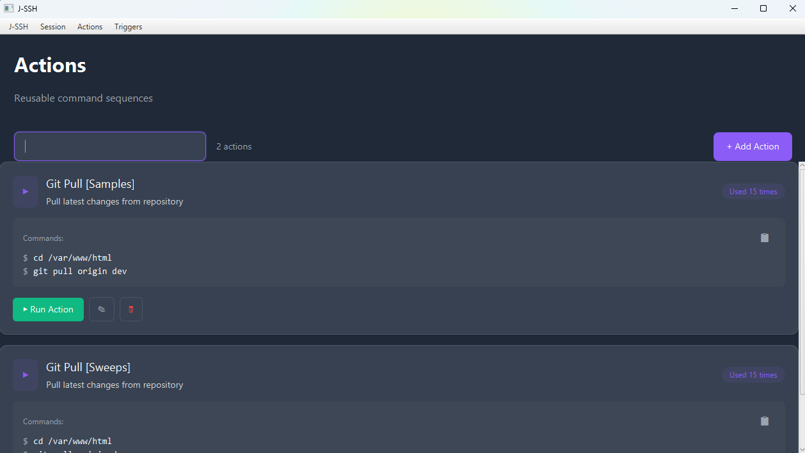
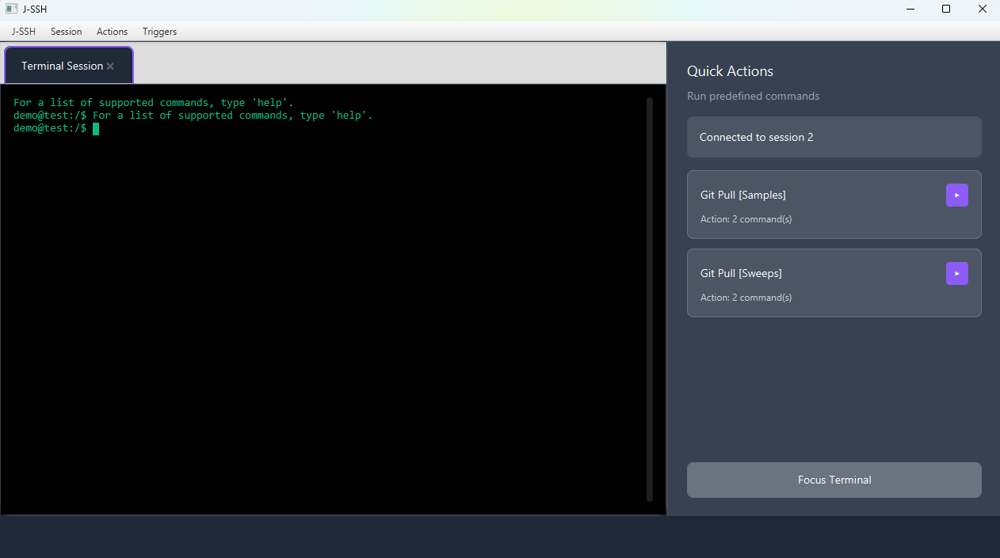
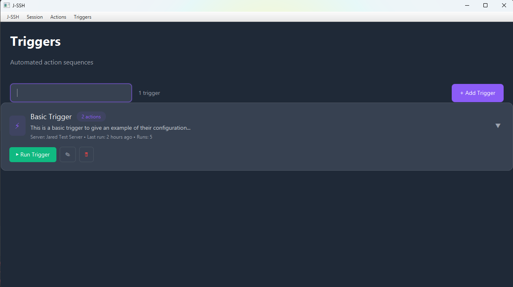

# J-SSH

<a rel="license" href="http://creativecommons.org/licenses/by-nc-sa/4.0/"></a><br />This work is licensed under a <a rel="license" href="http://creativecommons.org/licenses/by-nc-sa/4.0/">Creative Commons Attribution-NonCommercial-ShareAlike 4.0 International License</a>.


## 🚀 What is J-SSH?

J-SSH is a powerful and intuitive SSH client application built with JavaFX that simplifies server management through automation. It allows you to save SSH sessions, create reusable command sequences (actions), and execute complex operations across multiple servers with a single click.

### ✨ Key Features

- **📡 Session Management**: Save and manage SSH connections with credentials
- **⚡ Actions System**: Create reusable command sequences that can be executed with one click
- **🔗 Triggers**: Execute the same action across multiple servers simultaneously
- **🖥️ Modern Terminal Interface**: Clean, responsive terminal with tabbed sessions
- **💾 Data Persistence**: All configurations automatically saved to JSON
- **🔐 Secure Connections**: Built-in known hosts management and secure authentication
- **🎨 Intuitive UI**: Modern JavaFX interface with responsive design

### 🛠️ Core Components

- **Sessions**: Store server connection details (hostname, username, password, port)
- **Actions**: Define sequences of commands to execute on connected servers
- **Triggers**: Map actions to specific servers for bulk operations
- **Terminal**: Interactive shell interface with real-time command execution

## 📸 Screenshots

### Session Management

*Manage your SSH server connections with ease*

### Actions Configuration

*Create and organize reusable command sequences*

### Terminal Interface

*Clean, modern terminal interface with action buttons*

### Triggers Setup

*Configure automated actions across multiple servers*

## 🔧 Technical Requirements

- **Java**: Version 22 or higher
- **JavaFX**: Version 23 (included in project)
- **Operating System**: Windows, Linux, or macOS
- **Memory**: Minimum 512MB RAM recommended

### Dependencies

- **JSch**: SSH client library for Java
- **JavaFX**: Modern UI framework
- **JSON**: Data serialization
- **Lombok**: Code generation library

## 📦 Installation

### Prerequisites

1. **Java 22+**: Ensure you have Java 22 or higher installed
   ```bash
   java -version
   ```

2. **Maven**: For building from source (optional)
   ```bash
   mvn -version
   ```

### Option 1: Download Pre-built Release

1. Download the latest release from the [Releases](../../releases) page
2. Extract the ZIP file to your desired location
3. Run the application using the provided batch file:
   ```batch
   run.bat
   ```

### Option 2: Build from Source

1. **Clone the repository**:
   ```bash
   git clone https://github.com/your-username/J-SSH.git
   cd J-SSH
   ```

2. **Build the project**:
   ```bash
   mvn clean package
   ```

3. **Run the application**:
   ```bash
   java --module-path "javafx/javafx-sdk-25/lib" --add-modules javafx.controls,javafx.fxml,javafx.web -jar target/J-SSH-1.0-SNAPSHOT.jar
   ```

### Option 3: Development Setup

1. **Import into your IDE** (IntelliJ IDEA recommended)
2. **Configure JavaFX SDK path** in your IDE settings
3. **Set VM options**:
   ```
   --module-path "javafx/javafx-sdk-25/lib" --add-modules javafx.controls,javafx.fxml,javafx.web
   ```
4. **Run** `com.j_ssh.main.MainApp`

## 🎯 Usage Guide

### Getting Started

1. **Launch J-SSH**: Run the application using one of the installation methods above
2. **Create Your First Session**:
   - Click `Session` → `Create New Session`
   - Enter server details (hostname, username, password, port)
   - Give it a memorable nickname
   - Save the session

3. **Connect to a Server**:
   - Go to `Session` → `Open Session`
   - Select your saved session
   - Click "Connect"

### Working with Actions

1. **Create an Action**:
   - Navigate to `Actions` → `Create New Action`
   - Give your action a name
   - Add multiple commands (one per line)
   - Save the action

2. **Execute Actions**:
   - In the terminal, use the action buttons in the sidebar
   - Or use the Actions menu to trigger specific actions

### Using Triggers

1. **Create a Trigger**:
   - Go to `Triggers` → `Create New Trigger`
   - Map specific actions to specific servers
   - Save the trigger configuration

2. **Execute Triggers**:
   - Run the same action across multiple servers simultaneously
   - Perfect for system updates, deployments, or monitoring

### Example Workflows

**System Monitoring Action**:
```bash
df -h
free -m
top -n 1 -b | head -20
systemctl status
```

**Deployment Trigger**:
- Server 1: Execute "Deploy Frontend" action
- Server 2: Execute "Deploy Backend" action  
- Server 3: Execute "Update Database" action

## 🏗️ Architecture

J-SSH follows a clean MVC architecture:

- **Model**: Data objects and managers (`ServerData`, `ActionData`, `TriggerData`)
- **View**: JavaFX controllers and UI components
- **Controller**: Business logic and event handling
- **API**: Utility classes and popup handlers

### Key Classes

- `MainApp`: Application entry point
- `ConnectionManager`: Manages SSH connections
- `SessionManager`: Handles server session data
- `ActionManager`: Manages command sequences
- `TriggerManager`: Handles multi-server operations

## 🤝 Contributing

We welcome contributions! Please feel free to:

1. Fork the repository
2. Create a feature branch
3. Make your changes
4. Submit a pull request

## 📄 License

This work is licensed under a [Creative Commons Attribution-NonCommercial-ShareAlike 4.0 International License](http://creativecommons.org/licenses/by-nc-sa/4.0/).

### License Summary

- ✅ **Share**: Copy and redistribute the material
- ✅ **Adapt**: Remix, transform, and build upon the material
- ❌ **Commercial Use**: Cannot use for commercial purposes
- 📝 **Attribution**: Must give appropriate credit
- 🔄 **ShareAlike**: Must distribute under same license

---

<div align="center">
  <strong>Built with ❤️ using JavaFX and JSch</strong>
</div>
